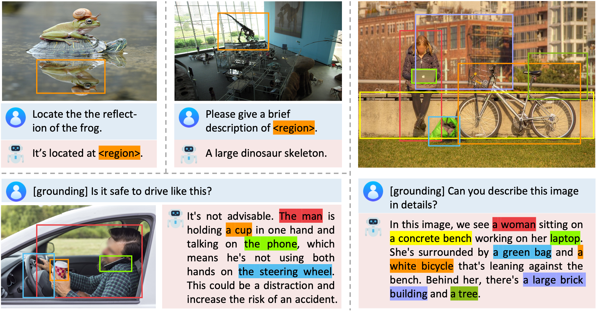
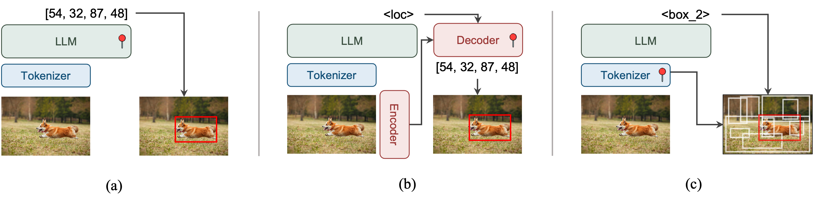

<div align="center">
<h1> Groma: Grounded Multimodal Assistant </h1>

> [**Groma: Localized Visual Tokenization for Grounding Multimodal Large Language Models**](https://arxiv.org/abs/2404.13013)               
> **Chuofan Ma, Yi Jiang, Jiannan Wu, Zehuan Yuan, Xiaojuan Qi**
> 
><a href="https://arxiv.org/abs/2404.13013"></a>
><a href='https://groma-mllm.github.io/'></a>
><a href='https://huggingface.co/FoundationVision/groma-7b-finetune'></a>
><a href='https://huggingface.co/datasets/FoundationVision/groma_instruct'></a>


<p align="left">Groma is an MLLM with exceptional region understanding and visual grounding capabilities. It can take user-defined region inputs (boxes) as well as generate long-form responses that are grounded to visual context.</p>


<p align="left">Groma presents a novel paradigm of grounded MLLMs. (a) LLM for localization (e.g., Kosmos-2, Shikra); (b) External modules for localization (e.g., Lisa); and (c) <b>Visual tokenier for localization (Groma)</b>.

</div>


## Contents
- [Install](#installation)
- [Model](#model-weights)
- [Data](#prepare-data)
- [Training](#training)
- [Inference](#inference)
- [Evaluation](#evaluation)


## Performance
State-of-the-art performance on referring expression comprehension (REC) benchmarks among multimodal
large language models.

<table>
    <thead>
    <tr>
        <th rowspan="2">Method</th>
        <th colspan="3">RefCOCO</th>
        <th colspan="3">RefCOCO+</th>
        <th colspan="2">RefCOCOg</th>
        <th rowspan="2">Avergae</th>
    </tr>
    <tr>
        <th>val</th>
        <th>testA</th>
        <th>testB</th>
        <th>val</th>
        <th>testA</th>
        <th>testB</th>
        <th>val</th>
        <th>test</th>
    </tr>
    </thead>
    <tbody>
    <tr align="center">
        <td>Shikra</td>
        <td>87.01</td>
        <td>90.61</td>
        <td>80.24</td>
        <td>81.60</td>
        <td>87.36</td>
        <td>72.12</td>
        <td>82.27</td>
        <td>82.19</td>
        <td>82.93</td>
    </tr>
    <tr align="center">
        <td>Ferret</td>
        <td>87.49</td>
        <td>91.35</td>
        <td>82.45</td>
        <td>80.78</td>
        <td>87.38</td>
        <td>73.14</td>
        <td>83.93</td>
        <td>84.76</td>
        <td>83.91</td>
    </tr>
    <tr align="center">
        <td>MiniGPT-v2</td>
        <td>88.69</td>
        <td>91.65</td>
        <td>85.33</td>
        <td>79.97</td>
        <td>85.12</td>
        <td>74.45</td>
        <td>84.44</td>
        <td>84.66</td>
        <td>84.29</td>
    </tr>
    <tr align="center">
        <td>Qwen-VL</td>
        <td>89.36</td>
        <td>92.26</td>
        <td>85.34</td>
        <td>83.12</td>
        <td>88.25</td>
        <td>77.21</td>
        <td>85.58</td>
        <td>85.48</td>
        <td>85.83</td>
    </tr>
    <tr style="background-color: #ADD8E6;">
        <th>Groma</th>
        <th>89.53</th>
        <th>92.09</th>
        <th>86.26</th>
        <th>83.90</th>
        <th>88.91</th>
        <th>78.05</th>
        <th>86.37</th>
        <th>87.01</th>
        <th>86.52</th>
    </tr>
    </tbody>
</table>

## Installation
Clone the repository
~~~
git clone https://github.com/FoundationVision/Groma.git
cd Groma
~~~

Create the conda environment and install dependencies
~~~
conda create -n groma python=3.9 -y
conda activate groma
conda install pytorch==2.1.0 torchvision==0.16.0 torchaudio==2.1.0 pytorch-cuda=11.8 -c pytorch -c nvidia
pip install --upgrade pip  # enable PEP 660 support
pip install -e .

cd mmcv
MMCV_WITH_OPS=1 pip install -e .
cd ..
~~~

Install falsh-attention for training
~~~
pip install ninja
pip install flash-attn --no-build-isolation
~~~


## Model Weights
To play with Groma, please download the [model weights](https://huggingface.co/FoundationVision/groma-7b-finetune) from huggingface. 

We additionally provide pretrained checkpoints from intermediate training stages. 
You can start from any point to customize training.

| Training stage | Required checkpoints |
|:--------------:|:--------------------:|
| Detection pretraining | [DINOv2-L](https://huggingface.co/facebook/dinov2-large) |
| Alignment pretraining | [Vicuna-7b-v1.5](https://huggingface.co/lmsys/vicuna-7b-v1.5), [Groma-det-pretrain](https://huggingface.co/FoundationVision/groma-det-pretrain) |
| Instruction finetuning | [Groma-7b-pretrain](https://huggingface.co/FoundationVision/groma-7b-pretrain) |


## Prepare Data
We provide instructions to download datasets used at different training stages of Groma, 
including [Groma Instruct](https://huggingface.co/datasets/FoundationVision/groma_instruct/),
a 30k viusally grounded conversation dataset constructed with GPT-4V.
You don't have to download all of them unless you want to train Groma from scratch.
Please follow instructions in [DATA.md](docs/DATA.md) to prepare datasets.

<table>
  <tr>
    <th align="left">Training stage</th>
    <th align="left">Data types</th>
    <th align="left">Datasets</th>
  </tr>
  <tr>
    <td align="left">Detection pretraining</td>
    <td align="left">Detection</td>
    <td align="left">COCO, Objects365, OpenImages, V3Det, SA1B</td>
  </tr>
  <tr>
    <td rowspan="4" align="left">Alignment pretraining</td>
    <td align="left">Image caption</td>
    <td align="left">ShareGPT-4V-PT</td>
  </tr>
  <tr>
    <td align="left">Grounded caption</td>
    <td align="left">Flickr30k Entities</td>
  </tr>
  <tr>
    <td align="left">Region caption</td>
    <td align="left">Visual Genome, RefCOCOg</td>
  </tr>
  <tr>
    <td align="left">REC</td>
    <td align="left">COCO, RefCOCO/g/+, Grit-20m</td>
  </tr>
  <tr>
    <td rowspan="4" align="left">Instruction finetuning</td>
    <td align="left">Grounded caption</td>
    <td align="left">Flickr30k Entities</td>
  </tr>
  <tr>
    <td align="left">Region caption</td>
    <td align="left">Visual Genome, RefCOCOg</td>
  </tr>
  <tr>
    <td align="left">REC</td>
    <td align="left">COCO, RefCOCO/g/+</td>
  </tr>
  <tr>
    <td align="left">Instruction following</td>
    <td align="left">Groma Instruct, LLaVA Instruct, ShareGPT-4V</td>
  </tr>
</table>


## Training
For detection pretraining, please run
~~~
bash scripts/det_pretrain.sh {path_to_dinov2_ckpt} {output_dir}
~~~

For alignment pretraining, please run
~~~
bash scripts/vl_pretrain.sh {path_to_vicuna_ckpt} {path_to_groma_det_pretrain_ckpt} {output_dir}
~~~

For instruction finetuning, please run
~~~
bash scripts/vl_finetune.sh {path_to_groma_7b_pretrain_ckpt} {output_dir}
~~~


## Inference
To test on single image, you can run
~~~
python -m groma.eval.run_groma \
    --model-name {path_to_groma_7b_finetune} \
    --image-file {path_to_img} \
    --query {user_query} \
    --quant_type 'none' # support ['none', 'fp16', '8bit', '4bit'] for inference
~~~


## Evaluation
For evaluation, please refer to [EVAL.md](docs/EVAL.md) for more details.


## Citation
If you find this repo useful for your research, feel free to give us a star ⭐ or cite our paper:
```
@misc{Groma,
      title={Groma: Localized Visual Tokenization for Grounding Multimodal Large Language Models}, 
      author={Chuofan Ma and Yi Jiang and Jiannan Wu and Zehuan Yuan and Xiaojuan Qi},
      year={2024},
      eprint={2404.13013},
      archivePrefix={arXiv},
      primaryClass={cs.CV}
}
```


## Acknowledgement
Groma is built upon the awesome works 
[LLaVA](https://github.com/haotian-liu/LLaVA/) and 
[GPT4ROI](https://github.com/jshilong/GPT4RoI).


## LICENSE
This project is licensed under the Apache License 2.0 - 
see the [LICENSE](LICENSE) file for details.
